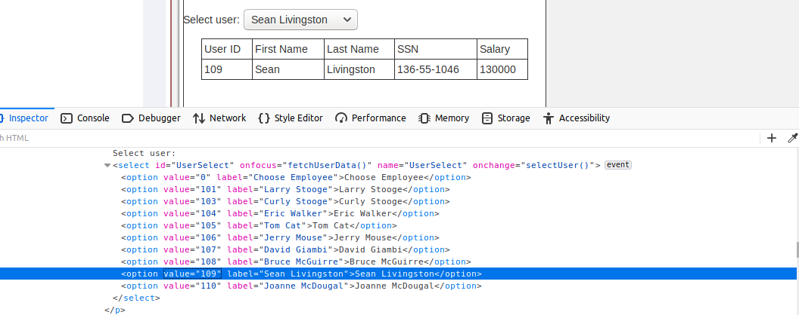
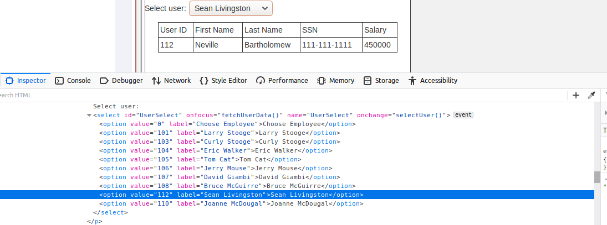

Giust Alberto Mat. 211460

# Homework-4

## Client side filtering Exercise 2 

This webpage permits to select a employer from a dropdown menu and, when clicked the option, the table is composed with the date of the selected user. If you open the firefox ispector and you search for the dropdown menu (`<select>`), you can see that 2 different Javascript functions are triggered: if you `onfocus` on the select menu, `fetchUserData()` will be called, while if you click on an option, `selectUser()` will be called. These are the definitions of the two funcions:
```javascript

//localhost:8081/WebGoat/lesson_js/clientSideFiltering.js
var dataFetched = false;

function selectUser() {

    var newEmployeeID = $("#UserSelect").val();
    document.getElementById("employeeRecord").innerHTML = document.getElementById(newEmployeeID).innerHTML;
}

function fetchUserData() {
    if (!dataFetched) {
        dataFetched = true;
        ajaxFunction(document.getElementById("userID").value);
    }
}

function ajaxFunction(userId) {
    $.get("clientSideFiltering/salaries?userId=" + userId, function (result, status) {
        ...
    });
}
```
`fetchUserData()` is called once, thanks to `dataFetched` variable, and this function calls a n Ajax function that retrieves user data by id but, if you look at the response body, you can see that all the employers are retrieved, and when you click on a `<option>`, the user id is retrieved, and the relative employer is shown in the table. So, if you change the option id with another id, like the id **112** (found by looking at the JSON response of the api call `clientSideFiltering/saaries?userId=`, that can be intercepted using ZAP, or by looking at firefox Network tab), the CEO data is shown.




### Solution of the exercise

As shown in the second image, the salary of the CEO, **Neville Bartholomew** is 450000.


## Client side filtering Exercise 3

If you open the firefox inspector, you will notice two strange HTML lines: `<input id="discount" value="0" type="hidden">0`, and `<!--Checkout code: webgoat, owasp, owasp-webgoat-->`. You can try to insert one of these checkout code, but the most discount you can get, it will be 50%. If you insert a code, you will notice that the text of the input field will change, with the value of the discount, but if you change this value manually, you won't obtain ay discount. This means that the evaluation of the input text happens after the discount application. 

There is a Javascript script that explain how these actions are perfomed: `/WebGoat/lesson_js/clientSideFilteringFree.js`. If you scroll through the function definition, you will see there is an Ajax function, triggered when you _blur_ off the checkout input field. Inside this function, there is a get call to `/WebGoat/clientSideFiltering/challenge-store/coupons/ + discount_code`. If you call this function, you will obtain the JSON response with the discount percentage. If you don't insert any **discount_code**, you will obtain a list of all the discount codes, also the one with 100% discount!

```
{
  "codes" : [ {
    "code" : "webgoat",
    "discount" : 25
  }, {
    "code" : "owasp",
    "discount" : 25
  }, {
    "code" : "owasp-webgoat",
    "discount" : 50
  }, {
    "code" : "get_it_for_free",
    "discount" : 100
  } ]
}

```

I noticed later that if you don't input any discount code and you blur off the input field, the GET call is mad with blank input, retrieving the same as above.

### Solution of the exercise

The discount code is: **get_it_for_free**.