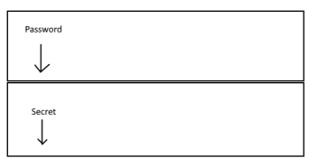

# Homework-6

## Exploitation (no version string)

If you compile the program using `gcc -g -O0 -fno-stack-protector exercise.c && ./a.out`, you can exploit the input of the password to login without knowing the right password. In fact, the two strings are allocated one after the other, and you can overflow the buffer string and overwrite the memory allocated for the `secret`, as shown in the image. If you know the maximum length of the password string and the maximum length of the secret, you can fill the input text with the max number of characters for password, and then the same characters again, and it will override the content of the secret.



### Example

- Input: **aaaaaaaaaa**aaaaaaaaaa. **Bold** a characters will be allocated in the password string, while normal a will be allocated in the secret. The result is shown in the screenshot below.


## Exploitation (version string)

If you know the length of the string between the password and secret strings, you can use buffer overflow in the same way as above, knowing that you have to put wild characters between the two.

### Example

- Input: **aaaaaaaaaa** _1.0_ aaaaaaaaaa: **Bold** a will be allocated in password string, _italic_ characters will be allocated in version string and normal a will be allocated in secret string.


## Vulnerability fix

You can fix the vulnerability in 2 ways: you can `strcpy()` the secret after the user input the text, or you can limit the characters for the user input. I choose the second option, since the password string has a specified length. You can use the `char *fgets(char *s, int size, FILE *stream);` function. The code fixed is shown below. You must add `password[strlen(password)-1] = '\0';` after the fgets because this function takes as an input also the `\n` characher. 

``` c
#include <stdio.h>
#include <stdlib.h>
#include <string.h>

int main() 
{

 char secret[10];
 char version[3] = "1.0";
 char password[10];

 memset(secret, 0, 10);

 printf("%x\n", &secret);
 printf("%x\n", &password);

 //printf("%s\n", secret);
 //printf("%s\n", password);

 strcpy(secret, "pass");

 printf("Please enter the password: \n");

 fgets(password,strlen(password), stdin);
 password[strlen(password)-1] = '\0';

 if (strcmp(password, secret) == 0) {
  printf("\nCorrect password!\n");
 } else {
  printf("\nWrong password!\n");
 }

 printf("%s\n", secret);
 printf("%s\n", password);


 return 0;
}


```


